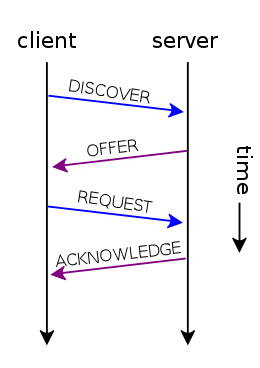

--- 
marp: true
title: Wprowadzenie do protokołów sieciowych
author:
  name: Artur Łoziński
  twitter: jdan
  url: http://jordanscales.com
controls: true
description: Wprowadzające informacje o najbardziej podstawowych protokołach sieciowych
theme: uncover
transition: fade
paginate: true

---

# Protokoły sieciowe

wprowadzenie

---

# <!--fit--> ISO/OSI Model

* Model referencyjny
* Warstwowość
* Poziomy abstrakcji
* Zbyt rozbudowany

---

# ISO/OSI vs TCP/IP

---

# <!--fit--> Warstwa fizyczna

Definuje w jaki sposób kodowane są dane na nośniku

Ciekawe przypadki

* chirp (**LoRa**)
* cdrom
* QAM (**LTE/5G**)

---

# <!--fit--> Data Link Layer

Określa reguły komunikacji

* Początek/koniec transmisji
* Kontrola poprawności
* Adresowanie odbiorcy
* Media Access Control (**MAC**)

---

# Adres IP

Globalny adres komputera w sieci (liczba 32bitowa)
_xxx.yyy.vvv.zzz_

Obecnie ilośc komputerów jest znacznie większa niż 4 miliardy
Jak sobie z tyum poradzić?
* IPv6
* **N**etwork **A**ddress **T**ranslation

---

# Typy adresatów

* _unicast_ - jeden adres IP
* _multicast_ - grupa odbiorców
* _broadcast_ - wszyscy (w podsieci)

---

# ARP

* Wyszukuje odbiorcę w sieciach lokalnych
* w modelu **TCP/IP** oznacza to translację z adresu _IP_ na _MAC_

---

# <!--fit--> DHCP

* **Dzierżawa** danych komunikacyjnych
* adres ip
* adres bramki sieciowej
* adres serwera DNS
* maska podsieci

---

# <!--fit--> DNS

* **FQDN** na IP
* pozwala na _balansowanie_ ruchu
* struktura drzewiasta
* [PiHole](pi-hole.net)

---

# <!--fit--> ICMP

* komunikaty kontrolne
* **ping** czyli _jest tam ktoś?_
* **traceroute** - nawigacja po internecie

---

# <!--fit--> Tablica routingu (_route_)

* Czyli którędy na świat
* Windows `route print`
* Linux `ip r`

---

# <!--fit--> Firewall (_iptables_)

* reguły dozwolonego ruchu
* tablica `iptables`

---

# VNC - zdalny dostęp

* dostęp do pulpitu
* działa  między Windows a Linux
* VNC server (np raspi-config, 3, 3, _yes_)
* łączymy się klientem (np.
        [tigerVNC](https://github.com/TigerVNC/tigervnc/releases)
* **UWAGA** połączenie nie jest szyfrowane!

---

# <!--fit--> HTTP - pierwsze podejście

* podstawa _www_
* model _request_/_response_
* metody (**GET/POST/PUT/DELETE** itp)
* _response status_ (np. **404**)
* składa się z **nagłówka** ( np _Cookies_) i **body**

---

# <!--fit--> TLS - _keep it secret_

* Z kim rozmawiam? (Certyfikat x.509)
* Szyfrowanie (zabezpieczenie przed podsłuchem)
* Dawniej było **SSL**

---

# <!--fit--> HTTPS

* TLS + HTTP
* `https://`

---

# Ciasteczka

* server wysyła _CookieSet_
* czyli zestaw danych, które chce otrzymywać od klienta _http_
* klient wysyła w następnych _request_
* w nagłówku, jako para _klucz/wartość_
* różne dane (od nazwy użytkownika
* poprzez rozdzielczość ekranu
* albo typ przeglądarki
* po analityczne)

---

# <!--fit--> Speed test - jak czytać wyniki

* [Speed Test](pro.speedtest.pl)
* Download ( z inernetu)
* Upload (z komputera)
* Ping (szybkość połączenia)
* Jitter (stabilność połączenia)

---

# <!--fit--> HTTP(S) i inne (w chmurze)

* **REST** (_JSON_ po http(s))
* **gRPC** (_protobuf_ po http(s))
* **MQTT** (_publish/subscribe_)
* **websocket** (dwustronny http)

---

# <!--fit--> Embedded (**LwM2M**)

Dedykowany do niskiego poboruy mocy

---

# <!--fit--> Embedded (**matter**)

Standard _inteligentnego domu_

---

